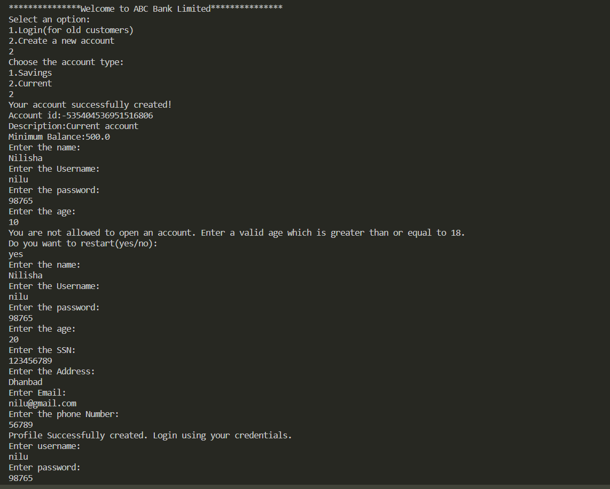

# Banking Application
A banking application made using java.
  
  
### Application Screenshots

### Tasks Done

Modified the code in [Main branch](https://github.com/nilisha-jais/Banking-Application) to implement

A. Change the Account class to an abstract class, with display as abstract 
method.

B. Add an interface named Validation with two methods.
- validateSSN()
- validateAge()

C. Implement Validation methods in customer class.
- validateSSN()
This should validate if the the SSN number has 9 digits
- validateAge()
This will validate if the the age of customer is greater than
18 year to open an account.
